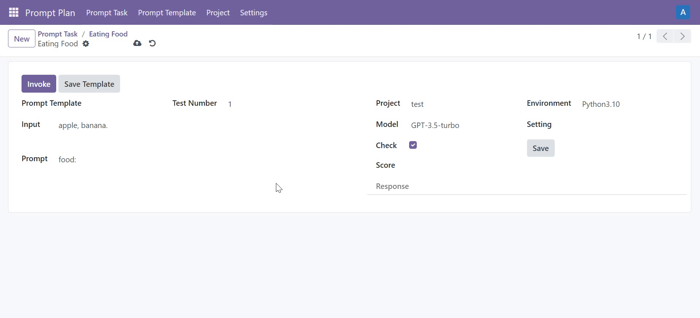

# PromptPlan: Build prompt test management system with odoo
PromptPlan can manage prompt, test, optimize prompt, score call records to evaluate prompt.
You can write simple test files to test prompt templates and maintain [the project](test_project/README.md#readme) according to the rules without changing the system code.

## demonstration


## How to use:
- odoo 17.0

Just like the odoo extension, configure odoo's configuration file, adding the following:
```
[options]
addons_path = PromptPlan\addons
...
```

## Contact me:
<a href="https://space.bilibili.com/493924710">Bilibili</a>
